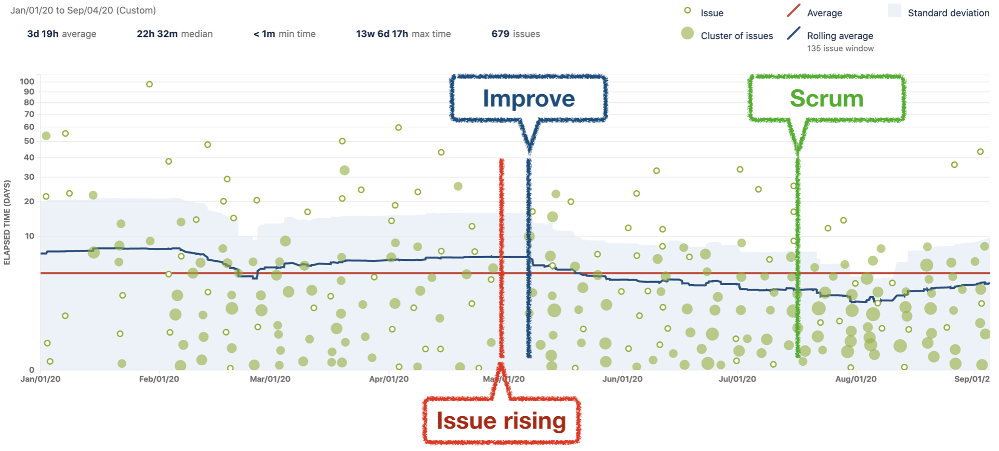

[이전 글](https://future-seller.dev/posts/odk-after-seven-months)에서 잠깐 언급했었지만
저희 팀은 JIRA를 통해 일감은 관리하고 있지만 생산성에 대한 이슈라이징의 결과 지난 5월부터 업무 프로세스의 격변이 있었습니다. 이 격변은 지금도 진행 중이고 다양한 접근 방법을 적용해나가고 있습니다.

이 글에는 격변기 동안 스크럼으로 일해본 과정에서 얻은 경험과 개인적인 생각이 담겨있습니다.
스크럼이 무엇인지에 대해 언급하면 너무 길어질 것 같고 [스크럼 가이드](https://www.scrumguides.org/docs/scrumguide/v1/Scrum-Guide-KR.pdf) 읽어보시면 조금이나마 도움이 되실 것 같습니다.

저는 아직까지도 애자일이 무엇인지 잘 모르고 스스로 정의를 내리지 못했습니다.
다만 기존의 방식을 애자일하게 바꿀 때 반드시 팀원들과의 충분한 대화 후 합의가 이루어져야하며, 이전과 비교하여 생산성을 개선되었다는 것을 입증할 지표와 수단을 마련해놓은 뒤, 팀 혹은 프로젝트가 놓여진 상황마다 유연하게 적용되어야 하며, 적절치 않다면 과감히 버릴수 있어야 한다는 생각을 갖게 되었습니다.
너무 당연한 이야기지만 중요하다고 생각합니다. <strike>가끔 아닌 곳도 있다고 해서요.</strike>

참고: 스크럼의 산출물 중 하나인 GraphQL 배포를 앞두고 있고 자세한 내막은 [ODC에 GraphQL 도입하기](https://wiki.lucashan.space/programming/introduce-a-graphql-to-odc.html)에서 보실 수 있습니다.

주의: 주저리 주저리 쓰다보니 본문이 많이 깁니다.

---

## 들어가기 앞서

 

위의 그래프는 JIRA에서 생성해주는 제품, 버전 또는 스프린트에 대한 사이클 타임을 볼 수 있는 컨트롤 차트입니다.
여기서 컨트롤 차트에 대한 자세한 내용은 [이곳](https://support.atlassian.com/jira-software-cloud/docs/view-and-understand-the-control-chart/)을 읽어보시면 도움이 될 것 같습니다.

본문은 컨트롤 차트의 타임라인 흐름대로 작성되어있습니다.

---

## Issue Rising: 우리는 이대로 괜찮은가?

제가 이슈라이징을 한 것은 아니고 [병대님](http://miconblog.com/)께서 JIRA 리포트들을 보고 현재 팀의 생산성에 대해 이슈라이징을 하셨습니다.
당시 사이클 타임의 Rolling Average가 Average보다 꽤 높았고 3월 경 부터 낮아지지 않고 점점 증가하는 추세를 보여 전체적으로 팀이 다운되어있는 걸 인지하게 되었습니다.

여기서 대두된 문제들이 많지만 몇 가지를 언급해보자면 아래와 같습니다.

- 리드 엔지니어에게 너무 많은 이슈가 몰려있다.
- 이슈의 크기/범위가 너무 크거나 모호해서 이슈를 쳐내는 데 오래 걸린다.
- 우선순위/명확한 목표를 논의하지 않고 일을 진행하다보니 흐지부지되는 경우가 생긴다.

---

## Improve: 칸반 기반의 프로젝트 별 이슈 진행

위의 언급한 문제들을 해결하기 위한 방법으로 산재되어 있는 일을 묶고 프로젝트화 한 뒤,
각각 프로젝트마다 리드와 플레이어들을 정하고 플래닝을 통해 우선순위와 목표를 정한 뒤 최대한 일을 작은 단위로 쪼갠뒤 일을 진행하기 시작했습니다.

5월 초부터 칸반으로 프로젝트들을 병렬적으로 진행했고, 프로젝트에서 일정 기간에 작업될 이슈들을 에픽으로 묶어 플래닝하기 시작했습니다.
JIRA에서 말하는 에픽은 여러 스프린트에 걸쳐 종료되며 여러 스토리의 집합을 의미하지만,
저희 팀에서는 에픽을 명확한 목표와 종료일을 가진 하나의 묶음 혹은 단위로 사용하였습니다.

이 때 부터 컨트롤 차트를 보면 Rolling Average가 낮아지고 있고, 팀의 생산성이 좋아지는 것을 알 수 있었습니다.
물론 이것 외에 머지룰 재정립, 일감 관리 규칙 합의 등 다양한 개선들이 있었습니다.

저는 이 무렵 [루카스](https://wiki.lucashan.space/intro.html)와 GraphQL 프로젝트를 진행하고 있었습니다.
루카스는 혼자 개인의 워크 로그를 기록하고 있었고 평소 어느정도의 생산성을 내고 있는지 가늠하고 있었습니다.
같이 일하다보니 저도 워크 로그에 관심이 생겼고, 시간 추정을 한번 해보지 않겠냐는 제안에 사용하지 않았던 JIRA의 기능을 사용하게 되었습니다.

 

 

위의 Original Estimate에 분단위로 작업의 예상소요시간을 기록하고 (e.g., 30m), 작업을 하는 중간중간 혹은 종료했을 때 실제 작업을 진행한
시간을 기록할 수 있습니다. 이걸 2주쯤 하다보니 각 이슈들이 얼마의 시간이 소요될 지 추정할 수 있게 되었고 플래닝할 때
하나의 에픽이 어느정도 걸릴지 예측하기 시작했습니다. 업무 프로세스가 익숙해질 무렵 하나의 제안을 받았습니다.

> 스크럼으로 일해보시지 않을래요?

---

## 스크럼?

저와 루카스 둘 다 스크럼에 호기심이 있었기에 흔쾌히 제안을 수락했습니다.
이미 알게 모르게 스크럼반으로 일하고 있었기 때문에 거부감이 없었던 것 같습니다.
이렇게 저희 팀의 첫 스크럼이 시작되었고 구성원은 아래와 같습니다.

- 스크럼 마스터 (병대님)
- 리드 플레이어 (루카스)
- 플레이어 (나)

저희의 스크럼은 가이드에 나온 대로 진행되진 않았습니다. 사실 스크럼 마스터가 제안하는대로 했지만 뒤늦게 생각을 해보니
GraphQL은 프론트엔드 팀에서 Bottom Up으로 역제안 하는 형태로 진행되었기 때문에 제품 책임자도 없을 뿐더러,
최대한 배포 일정을 당기기 위해 스프린트 준비 기간을 거의 갖지 않았었습니다. <strike>쉬지 않고 일했다는 거지요.</strike>
또한 가이드에 나온 모든 프로세스를 따르기엔 불필요한 과정이 많다고 생각했기 때문입니다.

이렇게 진행한 가장 큰 이유는 새로운 업무 프로세스에 대한 진입 장벽을 낮추는 것과 스크럼 마스터를 제외한 플레이어들이 스크럼 경험이 전혀 없었기 때문에, 그리고 스크럼 마스터도 마스터 롤이 처음이였기 때문에 점진적으로 개선해나가기로 했습니다.
특히 저희는 작은 단위의 팀이기 때문에 일일 스크럼이 불필요하다고 생각했습니다.

### 플래닝

플래닝을 하기 시작했고 과정은 아래와 같았습니다.

- 1: 스크럼 목표(개발 범위)를 정하고 에픽을 만든다.
- 2: 스토리, 그리고 하위 Feature 들을 뽑고 자세하게 명세한다.
- 3: 스토리 포인트를 통해 난이도 기반의 추정을 한다.
- 4: 하위 Feature들의 예상 작업 시간들을 추정한다.
- 5: 모든 스토리와 하위 Feature들에 에픽 링크를 건다.
- 6: 산출된 포인트와 각각 개인이 스프린트에 온전히 사용할 수 있는 시간을 고려한 종료 일정을 정한다.

스토리 포인트를 사용한 추정에는 [몇 가지 기준과 방법들](https://www.atlassian.com/agile/project-management/estimation)이 있지만 저희는 스토리 포인트를 매기는 척도로 난이도를 사용했습니다.

- 1: 금방 끝난다. (~ 2시간)
- 2: 어떻게 구현 하는지 잘 알고 있고 약간 시간이 걸린다. (2 ~ 3시간)
- 3: 하루 안에 끝난다. (4시간)
- 4: 하루 안에 끝나지만 난이도가 좀 있다. (야근을 좀 할 수도 있다)
- 5: 하루 이상 걸리고 얼마나 걸릴지 가늠이 안된다.

### 스프린트

스프린트 중에는 JIRA가 생성해주는 번 업, 번 다운 차트를 지속적으로 보았고 가이드라인을 통해 업무의 진척도를 판단했습니다.
번 다운 차트는 스프린트의 실제 작업 속도를 가늠하고 작업이 얼마나 남았나 보는데 사용했고,
번 업 차트는 완료된 작업량을 파악하여 스프린트의 목표를 종료일에 달성할 수 있는 지 여부를 파악하는데 사용했습니다.

위의 차트는 번 업 차트이며 X축은 스프린트 시작일부터 종료일을 보여주는 타임라인, Y축은 스토리 포인트를 의미합니다.

- 빨간 선: 스토리 포인트의 총합
- 초록색 선: 완료된 스토리 포인트의 누적된 값
- 회색 선: 가이드라인; 제가 느끼기엔 하루에 성취해야할 목표로 다가왔고 가이드라인에 가까워야 기간내에 완료할 가능성이 높아진다는 것을 의미합니다.

 

위의 차트는 번 다운 차트이고 X축은 스프린트 시작일부터 종료일을 보여주는 타임라인, Y축은 시간의 합을 의미합니다.

- 빨간 선: 스프린트에 사용할 수 있는 남은 시간
- 초록색 선: 실제 작업에 소요한 시간의 합
- 회색 선: 가이드라인

### 회고

회고는 스크럼 마스터인 병대님께서 회고 폼을 만들어 주셨고 질의에 대한 응답을 기반으로 스프린트에 대해 논의하는 방식으로 진행되었습니다.
회고를 어떻게, 얼마나 솔직하고 담담하게 진행하느냐가 스크럼의 성공의 여부를 가른다고 생각합니다.
개인적으로는 스크럼 마스터의 역할이 정말 중요하다고 생각되는 부분이 회고라고 생각합니다.
자칫 잘못하면 회고 시간이 책임을 전가하거나 비난하는 시간이 될 수 있기 때문입니다.

회고는 주로 1 ~ 2시간을 잡았고 모두 원격 근무를 하기 때문에 구글 행아웃을 사용했습니다.
스크럼 마스터와 리포트들을 보고 추정이 잘 되었는 지 분석하고, 다음 스프린트에도 유지해야 할 것 혹은 버렸으면 하는 점을 가감없이 얘기하는 시간을 가졌었고 Action Item과 결정된 사항에 대해 컨플루언스에 기록해두었습니다.

---

## 한 달간 4번의 스프린트: 결과는 나름 성공적?

컨트롤 차트를 다시 보면 스크럼을 시작한 이 후 Rolling Average는 점점 떨어졌고,
팀 내 여러 프로젝트에 스크럼을 적용하게 된 계기가 되었습니다.
모든 스프린트를 언급하기는 조금 지루해질 것 같고 두 번의 스프린트만 JIRA 리포트를 보며 공유하고자 합니다.

### 나름 추정에 성공했다고 생각하는 스프린트: 3번째 스프린트

아무래도 경험이 어느정도 쌓인 3번째 스프린트가 가장 추정치에 가깝지 않았나 싶습니다.
번 업 차트를 보면 스토리포인트가 가이드라인을 점점 따라가고 있기 때문이고 적절한 난이도와 시간을 배분했기 때문이라고 생각합니다.

물론 번 다운 차트를 보면 스프린트의 완료 추정치보다 시간을 적게 쓰긴했지만,
마지막 쯤 빨간 선이 급격히 떨어지는 것을 볼 때 하나의 이슈가 생각보다 일찍 해결되어 그런 것임을 짐작할 수 있습니다.

### 추정에 실패했다고 생각하는 스프린트: 4번째 스프린트

경험이 쌓였음에도 추정에 실패한 스프린트도 있었습니다.
루카스가 다른 프로젝트의 스프린트에 참여하게 되어 초중반부터 거의 혼자 스프린트를 진행하게 되었습니다.
물론 이전에 몇몇 이슈는 루카스가 해결해주었습니다.

경험적으로 저희는 스프린트를 여러번 돌아본 결과 일주일에 25 ~ 30포인트 정도를 소화할 수 있었습니다.
스프린트를 혼자 진행하게 되어, 스토리 포인트를 반으로 나누었을 때 13 ~ 14포인트가 되었고 한 명분인 일주일로 일정을 잡았습니다.

차트만 보면 무슨 일을 이렇게 빨리 끝냈어? 라고 생각할 수 있는데, 몇 가지 간과한 점으로 인해 추정에 실패했습니다.
(참고로 릴리즈를 늦게해서 그래프가 저런 모양이 나왔고 8월 21까지만 보시면 됩니다.)
저희가 예상한 것 보다는 작업이 단순했고 루카스가 꽤 큰 이슈를 하나 해결하고 간 바람에 작업하는 시간이 극도로 짧아졌습니다.

되돌아보니 평소에 자주 해봤던 익숙한 작업이였기 때문에 좀 더 공격적으로 추정했어도 괜찮았을 것 같고,
스프린트 초중반부터는 혼자 진행해야한다는 점을 고려해서 버퍼를 좀 두었던 것이 추정에 실패한 원인인 것 같습니다.

---

## 스크럼에 대한 팀원들의 생각

병대님께서 스크럼을 점진적으로 팀의 전체 프로젝트에 전파한 결과 모든 팀원이 스크럼을 경험하게 되었습니다.
얼마 뒤 모든 팀원들이 모여 스크럼에 대해 얘기를 나눌 온라인 워크샵을 가졌고 공통적인 의견은 아래와 같습니다.

### 좋았던 점(플레이어)

- 할 일이 명확하고 종료 일정이 정해져 있는 것이 좋았다.
- JIRA의 기능을 제대로 쓰는 것 같아서 좋았다.
- 스크럼 마스터가 전체적인 큰 흐름을 가이드해주어서 좋았다.
- 업무 프로세스도 정리되고 코딩/스타일 컨벤션 같은 것들도 점검해서 좋았다.

### 좋았던 점(스크럼 마스터)

- 마스터로써 의도적으로 어떤 경험을 주어야겠다라는 생각을 먼저하고 의도적인 실험을 하고 이 과정에서 얻는 경험이 좋았다.
- 의도적으로 다른 사람들과 대화할 수 있는 기회가 있어 좋았다. (하지만 시간을 많이 써서 힘들었다.)

### 아쉬웠던 점

- 나도 모르게 업무에 너무 많은 힘을 쏟게 되어 제 3자가 제어할 필요가 있을 것 같다.
- 추정 및 시간관리가 어렵다. [병대님의 생체 실험(?)](http://miconblog.com/archives/351)을 보고 배워보자.
- 의존성이 생기는 일을 플래닝 단계에서 간과할 수 있기 때문에 주의해야 한다.
- 워크 프로세스가 자주 바뀌다보니 익숙치 못해서 시간을 많이 썼다.

### 기타: 휴식 그리고 스크럼을 꼭 해야할까?

휴식/재충전에 관한 논의도 있었는데 그 배경에는 저희 팀의 모든 스프린트는 재충전의 시간이 없었습니다.
너무 업무에 많은 힘을 쏟다보니 체력적, 정신적으로 힘들어졌다는 의견들이 있었고
이로 인해 스프린트 중, 플레이어가 번아웃이 오면 어떻게 하지? 등의 얘기도 나눴습니다.

모든 프로젝트를 굳이 스크럼으로 진행할 필요가 있을까라는 의견에
스크럼은 팀에서 단기적으로 명확히 보여주고 싶은 성과가 있을 때 진행하고 나머지 운영 이슈들은 칸반으로 운영하는 게 좋을 것 같다는 방향에 대부분 공감했습니다.

---

## 스크럼을 겪고 난 뒤 개인적인 생각

스크럼을 겪고 스프린트를 여러 번 달리다보니 심신이 좀 지친 것은 사실이지만,
플래닝을 통해 명확한 목표와 방향성이 있어 불필요한 일을 하지 않고,
마감일이 정해져있다는 것이 스스로 업무에 집중할 수 있는 환경을 조성하게 되는 것 같습니다.

글 도입부에도 언급했지만 의견을 자유롭게 제시할 수 있는 환경에서 팀원들과의 원활한 소통,
그리고 스크럼이 팀에 맞지 않는 다고 판단될 때 과감히 접을 수 있는 결단력이 중요하다고 생각합니다.
모종의 이유로 인해 스프린트에서 문제가 있었는 데 스크럼을 무리하게 유지하기엔 위험한 것 같습니다.
너무 뻔한 이야기인데 아무리 생각해도 중요하다고 생각합니다.

저는 스크럼에 대한 경험이 아직 많지 없어 조심스럽지만 스크럼 가이드를 꼭 따를 필요는 없다고 생각합니다.
<strike>이 부분은 스크럼 마스터인 병대님의 영향을 많이 받았는데 예를 들면 보드에 포스트잇 붙이는 걸 매우 싫어하십니다.</strike>
사실 팀에 맞게 적용하고 지속적인 회고를 통해 팀과 상황에 맞춰 적절히 변형하여 스크럼의 본질을 잃지 않으면 될 것 같습니다.

스크럼을 도입할 계획이 있다면 어떤 형태든 생산성을 정량적으로 나타낼 수 있는 데이터 혹은 도구를 꼭 마련해두고 진행하는 게 좋을 것 같습니다. 힘들게 팀원들을 설득해서 도입했는데 이전과 비교해 어떤 점이 좋고 나쁜지 알 수 없다면 일을 열심히 하고 있다는 느낌만 받을 뿐 실제로 그런진 알 수 없으니까요. 그런 점에서 JIRA가 정말 좋은 도구임을 새삼 깨닫게 되었고 알고 있는 만큼 활용할 수 있다는 것에 크게 공감했습니다. <strike>가끔 플러그인에 있는 기능들이 기본 기능으로 들어왔으면 하지만요..</strike>
