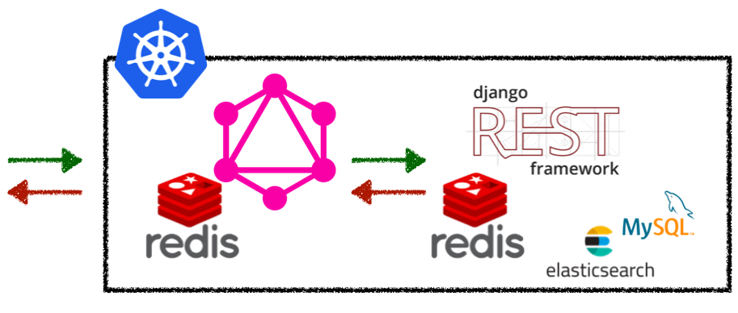

올해 진행했던 프로젝트 중 하나인 GraphQL 도입 및 운영에 대한 경험과 개인적인 생각을 공유하고자 합니다.
GraphQL 도입에 대한 자세한 이야기는 [ODC에 GraphQL 도입하기](https://wiki.lucashan.space/programming/introduce-a-graphql-to-odc.html)에서 확인하실 수 있고, 저는 개발, 도입, 운영에서 있었던 일과 개인적인 생각을 공유하고자 합니다.

저희는 Apollo Server와 Client를 선택했습니다.
근택님께서 Apollo Client와 Relay 사이에서 많은 고민을 하셨었는데,
Relay를 도입하기엔 현재 클라이언트의 코드 수정량이 많아지고 팀원들의 학습 비용이 너무 클 것이라는 태희님의 의견을 수용했기 때문입니다.

제가 잘못된 정보를 적어놓았을 수 있으니 잘못된 내용이 있다면 가감없이 커멘트 부탁드립니다.

---

## GraphQL로 풀고자 했던 것: 클라이언트의 부담을 덜어주자

### Error-prune 한 직접 작성된 클라이언트의 모델

REST API의 응답을 TypeScript로 모델링 한 뒤 지속적인 관리가 되지않아 쌓여가는 부채를 덜어내고자 했습니다.
서비스 런칭 이후 모델이 점진적으로 바뀌었는데 이를 꾸준히 업데이트 하지 않았고 필요한 필드를 추가하는 방식이 되다보니
어떤 곳에서 side-effect가 발생할 지 모른 다는 위험이 도사리고 있었습니다.
종종 쓰이지 않는 모델이 남아있기도 했습니다.

저희는 이것을 GraphQL 스키마를 정의해두고 codegen이 자동으로 생성해주는 모델을 통해 부담을 덜어냈습니다.
이와 관련된 이야기는 [여기](https://wiki.lucashan.space/programming/introduce-a-graphql-to-odc.html#_4-%E1%84%86%E1%85%AE%E1%84%8B%E1%85%A5%E1%86%BA%E1%84%8B%E1%85%B5-%E1%84%80%E1%85%A2%E1%84%89%E1%85%A5%E1%86%AB%E1%84%83%E1%85%AC%E1%84%8B%E1%85%A5%E1%86%BB%E1%84%82%E1%85%B3%E1%86%AB%E1%84%80%E1%85%A1)를 읽어보시면 좋을 것 같습니다.

### 무거워진 클라이언트의 코드; 그리고 잃어버린 컨텍스트

Atomic한 REST API라는 큰 장점의 이면에 클라이언트의 코드는 점점 복잡해지고 있었습니다.
기능이 추가될 때마다 엔드포인트가 점점 늘어났고,
화면을 그리기위해 REST API 응답 간 의존성을 핸들링하기 위한 코드와 각종 유틸함수들이 생겨났습니다.

이런 유틸함수들은 REST API의 응답과 굉장히 의존성이 커서 주석이 있더라도 자세히 들여다봐야 컨텍스트를 파악할 수 있었습니다.
이 과정에서 기존에 코드를 작성했던 동료들과의 커뮤니케이션 비용이 발생했고,
그 당시에는 이해했지만 추후 다시 작성된 코드를 보면 이게 어떤 맥락에서 작성된 코드였는지 종종 고민하게 되었습니다.

이로인해 클라이언트는 최대한 뷰로직만 담당했으면 좋겠다는 염원을 가졌고, 별도의 API 서버를 두고 뷰로직에 필요한 응답을 모아서 내려주는 것은 어떨까라는 결론에 이르렀습니다.

### 문서화의 부담

[여기](https://wiki.lucashan.space/programming/introduce-a-graphql-to-odc.html#%E1%84%86%E1%85%AE%E1%86%AB%E1%84%89%E1%85%A5%E1%84%92%E1%85%AA)에도 언급되어 있듯이
백엔드 팀에 문서화에 대한 요청을 드리기에 조심스러운 상황이였습니다.
백엔드 팀 인원에 비해 너무 많은 일이 집중되어있는 상태였고,
Redoc을 통해 생성되는 문서가 종종 불충분한 정보를 제공해줘서 추가적인 커뮤니케이션 비용이 들어가기 시작했습니다.
또한 Redoc만 보고는 각각의 모델이 갖는 상관관계를 클라이언트에서 파악하기 어려웠던 점도 있었습니다.

GraphQL은 스키마 자체가 문서로써 동작하고 있기 때문에 별도의 문서화과정이 불필요하고,
스키마 작성할 때 적절한 설명을 추가하여 부담을 덜어줄 수 있습니다.
각각 스키마가 갖는 상관 관계를 graphql-voyager를 통해 모델간의 관계를 도식화하여 용이아게 파악할 수 있는 부가적인 장점도 가져갈 수 있었습니다.

### 성능 개선에 대한 염원

특정 컴포넌트들을 렌더링할 때 API들의 waterfall이 생겼고 응답이 오는 순서에 따라 컴포넌트들이 shift 되는 문제가 있어 사용자 경험을 해치는 문제가 있었습니다.
이를 사용자, REST API의 round-trip에서 GraphQL, REST API의 round-trip으로 바꾸면 상대적으로 낮은 지연으로 인한 이점을 얻을 수 있을 것 같았고,
한꺼번에 묶어 내려주면 shift가 되는 문제를 어느정도 해결할 수 있는 실마리가 될 수 있을 것이라 생각했습니다.

개발 과정에서 성능 테스트 중 당연하게도 한꺼번에 묶어주는 과정에서 지연이 생기는 현상이 발견되어
쿼리의 결과인 JSON을 캐싱해놓고 동일한 요청에 대해 GraphQL 서버의 내부 로직을 타지 않는 방향으로 가닥을 잡았습니다.

---

## GraphQL 서버: 클라이언트와 REST API 사이의 인터페이스



엄밀히 말하면 실제 구조와 동일하진 않지만 대략적으로 보자면 GraphQL 서버는 클라이언트와 REST API 사이의 인터페이스 역할하게 되었습니다.
이렇게 구성된 배경에는 우리가 잘 할 수 있는 것, 해결하고자하는 문제에 더 집중하고자 하는 공감대가 형성되었기 때문입니다.
GraphQL 서버가 모든 것을 다 해결할 수는 없고 너무 많은 것을 꾀하기엔 배보다 배꼽이 더 크다는 생각이 들었습니다.
예를 들면 직접 DB를 찌르거나 쿼리를 튜닝하기엔 전문성도 떨어지고 리스크가 크다고 생각했습니다.
클라이언트의 부담을 덜어주는 것이 저희의 주된 목표였기 때문에 REST API를 wrapping 하는 것으로 충분하다는 결론에 이르렀습니다.

### Performance Testing

사실 Redis를 처음부터 쓰고 싶었는데 정훈님께서 흐음.. 벌써 캐시를 쓰시려구요? 라는 말에 매우 동의했습니다.
저희는 GraphQL 서버가 어느 정도의 부하를 버틸 수 있는 지 알 수 없었고, 캐싱이 필요하다라는 결정을 내릴 수 있는 지표가 없었습니다.

부하테스트는 최대한 외부 요인을 없애기 위해 같은 인스턴스 3개 띄웠고 캐시를 붙이지 않은 상태에서
Artillery를 이용해 GraphQL 서버에 쿼리들을 날리는 스크립트를 작성했습니다.
처음에는 Warm-up phase와 Ramp-up phase를 구분해놓았었는데 캐시를 붙이지 않은 상태에서 큰 의미가 없는 것 같아 뺐습니다.
Artillery가 생성해주는 리포트들을 보며 GraphQL 서버가 감당할 수 있는 RPS(Request per seconds)를 알 수 있었고
생각보다 저조한 성능과 에러가 너무 많이 발생해서 걱정이 컸습니다.

너무 많은 요청을 각각의 인스턴스에서 만들어내다보니 GraphQL 서버와 Artillery가 열수 있는 파일 디스크립션의 숫자를 초과하는 문제가 있었습니다.
이로 인해 부하테스트 중 추가로 커넥션을 맺지 못해 GraphQL 서버에 부하를 온전히 주지 못하는 문제가 있어, 이 제한을 풀어주었습니다.

저조한 성능의 이유는 DRF의 dev와 staging 환경에는 저희가 요청하는 REST API 응답들은 REST API 앞단의 Redis에 캐싱하지 않고 있었습니다.
<strike>아..........</strike>
클라이언트의 부담을 덜고자 요청들을 묶어서 내리는데 모든 요청이 DB를 거쳤기때문에 지연이 생겼고,
하나의 지연이 묶음 요청을 모두 지연시키다보니 너무 저조한 성능이 나온 것입니다.
이는 역으로 보면 프로덕션에서 캐시가 비어있는 최악의 경우를 확인할 수 있었던 것이고,
지표를 모아들고 정훈님, 병대님과 얘기해본 결과 캐시를 붙여야겠다는 결론이 났습니다.

### Caching

처음엔 standalone 인스턴스 하나였기 때문에 In-Memory 개발되었고 처음 배포에는 그대로 나갔다가
k8s에 GraphQL 팟이 스케일링 될 때 인스턴스의 In-Memory 캐시간 Inconsistency 문제가 생겨 관리의 피곤함으로 인해 Redis를 붙이게 되었습니다.

캐싱을 할 대상에 대해 개발/운영 중 많은 고뇌를 함께 했습니다. 저희가 고민한 방법론은 아래 두 가지입니다.

#### Response Cache

- 쿼리에 대한 응답을 캐싱하는 방법
- 장점: GraphQL 서버의 내부 로직을 태우지 않고 바로 응답을 반환함
- 단점: REST API를 통해 재사용될 모델들이 중복되어 캐싱될 수 있어 불필요한 공간을 차지할 수 있음
- KEY: `sha256({ query, variables, contexts })`
- VALUE: REST API의 응답이 조합된 혹은 wrapping한 쿼리의 JSON 응답

#### Model Cache

- 모델에 대한 응답을 캐싱하는 방법
- 장점: 자주 쓰이는 모델들의 hit ratio가 높을 경우 유용함
- 단점: GraphQL 서버 내부 로직을 타야함
- KEY: `/path/to/rest-api?params=&`
- VALUE: REST API의 응답

저희는 리졸버를 태우지 않고 최대한 빠른 응답을 해주길 원했고,
REST API들이 같은 모델에 대해서도 각각의 엔드포인트마다 다른 필드들을 내려주는 경우가 있기 때문에
각 모델을 따로 관리할 지 캐싱된 모델을 확장해놓을지 고민하다가
REST API의 응답은 DRF 앞단의 Redis가 해줄 수 있다는 것을 깨닫고 고민 끝에 Response Cache를 선택했습니다.

여기서 잠재적인 문제는 GraphQL도 캐시를 가지고 있고 DRF도 캐시를 가지고 있기 때문에
캐시가 만료될 때 까지 상이한 결과를 줄 수 있는데, TTL(Time-to-live)를 믿고 이 부분은 스킵했습니다.

### Custom Directives

GraphQL을 도입하게된 가장 큰 배경인 클라이언트의 부담을 덜어주자는 차원에서
저희는 Cache control, Image resizing, Date format를 위한 디렉티브를 사용했습니다.

가장 유용하게 쓰인 것은 이미지 리사이징을 위한 디렉티브 입니다.
REST API의 응답에 이미지 원본의 url이 내려왔고, 이를 클라이언트에서 리사이징 url을 만들어 img 태그에 넣어주는 작업을 했었던 것을
GraphQL이 내려줄 때 리사이징 url 자체를 내려주도록 하여 부담을 덜어냈습니다.

아래와 같이 imageSize 디렉티브를 정의하고, Cover의 `thumbnailImage`, `coverImage` 필드에 사용할 것이라 명시합니다.

```graphql
directive @imageSize(width: Int, height: Int, clippingType: ImageClippingType) on FIELD_DEFINITION

type Cover {
  thumbnailImage: String! @imageSize
  coverImage: String! @imageSize
}
```

클라이언트에서는 필드에 각각의 값들을 넣어주기만 하면 리사이징 url을 내려줍니다.

```graphql
query Cover {
  thumbnailImage(width: 260, height: 147, clippingType: CENTER)
  coverImage(width: 1520, height: 536, clippingType: SMART)
}
```

여기서 저희는 디렉티브가 아닌 variable에 넣어도 되는게 아닌가라는 고민을 하게 되었습니다.
사실 variable에 넣어도 리졸버에서 각각의 값을 꺼내 리사이징 url을 만들어줄 수 있기 때문입니다.
그럼에도 불구하고 디렉티브를 사용하기로 한 이유는 리사이징이 될 대상이 필드임을 조금 더 명확히하고 싶었기 때문입니다.
Cover를 리사이징한다고 표현하는 것보다 `thumbnailImage`를 리사이징하는게 나중에봐도 오해를 불러오지 않고 컨텍스트를 잃지 않을 것이라 판단했습니다.

---

원래 하나의 글에 모두 담으려고 했는데 너무 길어져서 클라이언트 쪽 GraphQL 이야기와 개인적인 생각들을 2편에서 공개할 예정입니다.
